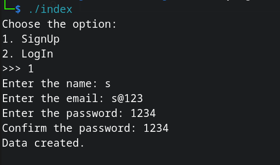
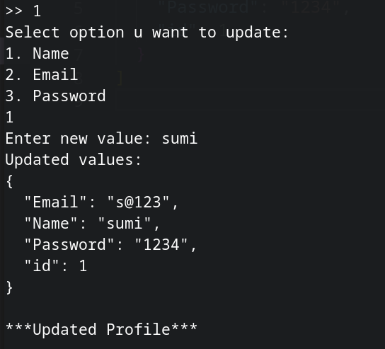
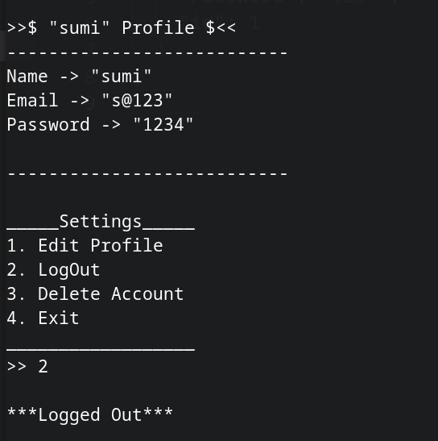
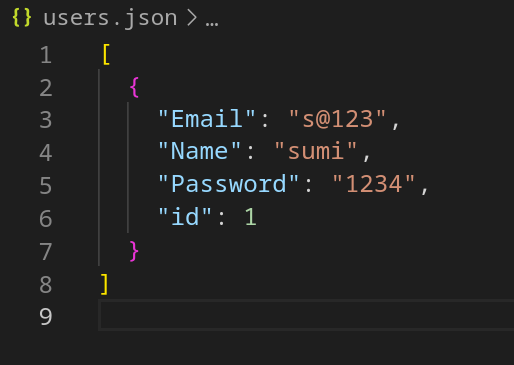

This is a simple project to learn how DataBase actually works.
In this project, JSON format is to be used in order to store the data.

So in order to use JSON format clone https://github.com/nlohmann/json.git repository and use json/single_include/nlohmann header files

run file by command:
./index
 
<h1>SignUp option</h1>

 
<h1>Profile of user</h1>
 

 
<h1>Edit profile option</h1>
 

 
<h1>Updated Profile</h1>
 

 
<h1>Json format of the data stored</h1>
 

 
